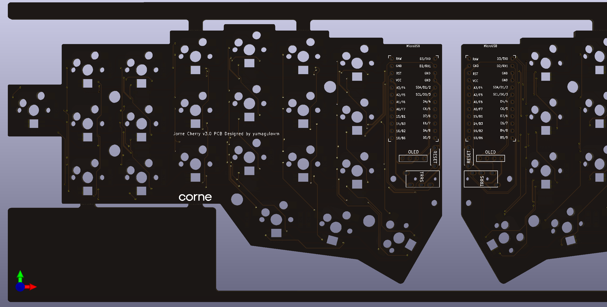
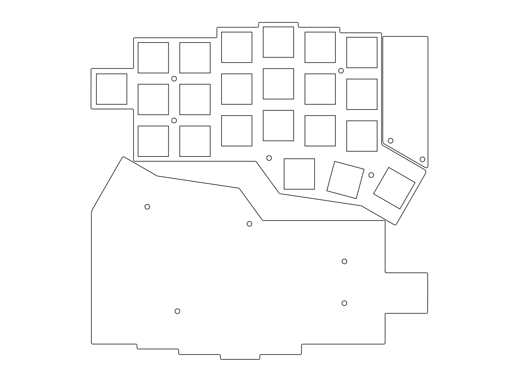
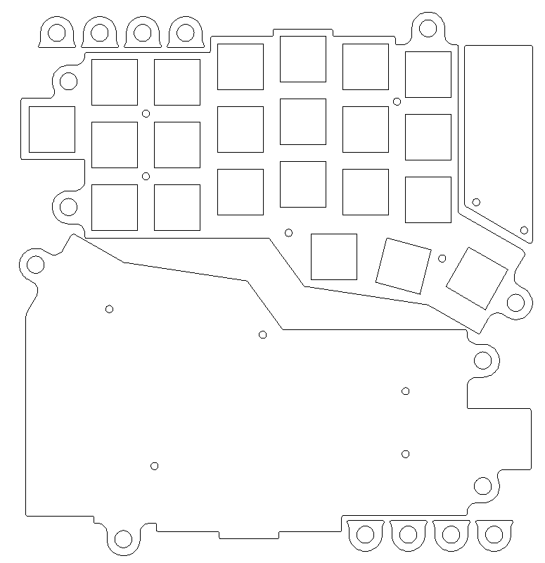
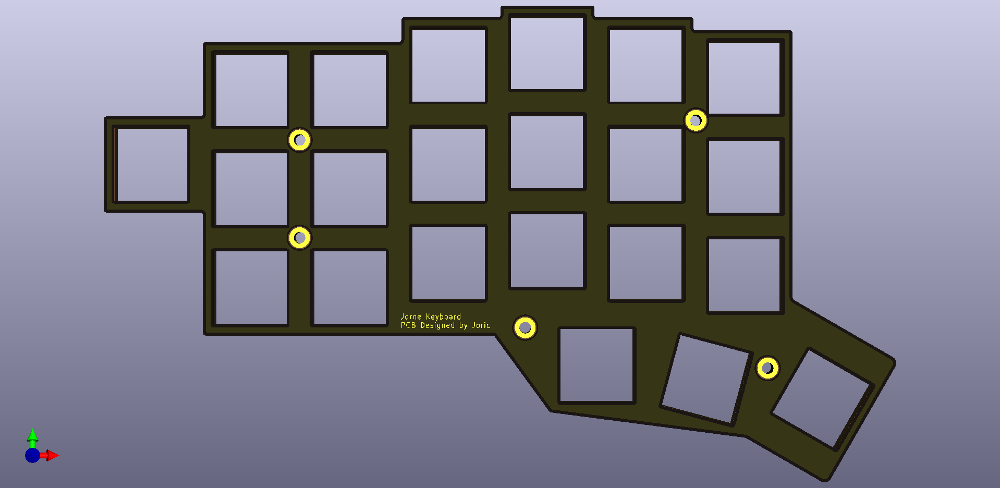
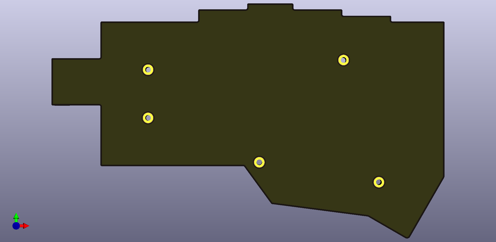

# Jorne keyboard

Please read project wiki for details: https://github.com/joric/jorne/wiki

## Disclaimer

The keyboard layout is derived from [Jian layout](http://www.keyboard-layout-editor.com/#/gists/4b6c2af67148f58ddd6c6b2976c4370f) (just visually, there was no actual copying involved).
Please buy Jian from its author, [/u/KgOfHedgehogs](http://reddit.com/u/KgOfHedgehogs), he's running a high quality commercial batch.

## PCB

### Jorne Classic 2.1

* [jorne-classic-2.1-gerbers.zip](https://github.com/joric/crkbd/raw/jorne/gerbers/jorne-classic-2.1-gerbers.zip) (classic version, with mounting holes and ground planes)

### Jorne Cherry 2.1

* [jorne-cherry-2.1-gerbers.zip](https://github.com/joric/crkbd/raw/jorne/gerbers/jorne-cherry-2.1-gerbers.zip) (hotswap version with kailh hotswap sockets, fixed version with all LED holes)

### Jorne Cherry 3.0

* [jorne-cherry-3.0-gerbers.zip](https://github.com/joric/crkbd/raw/jorne/gerbers/jorne-cherry-3.0-gerbers.zip) (non-reversible PCB with kailh hotswap sockets and south facing switches)

## Case

### Acrylic (13.85mm cutouts)

* [jorne-simple.dxf](https://github.com/joric/crkbd/raw/jorne/dxf/jorne-simple.dxf) (simple case, sheet size 154x154mm)

* [jorne-tilted.dxf](https://github.com/joric/crkbd/raw/jorne/dxf/jorne-tilted.dxf) (tilting-tenting case, sheet size 156x165mm)

### Steel (14.00mm cutouts)

* [jorne-simple-metal-plate.dxf](https://github.com/joric/crkbd/raw/jorne/dxf/jorne-simple-metal-plate.dxf) (simple plate, 14 mm cutouts)
* [jorne-tilted-metal-plate.dxf](https://github.com/joric/crkbd/raw/jorne/dxf/jorne-tilted-metal-plate.dxf) (tilting-tenting plate, 14 mm cutouts)

### Bottom plate

* [jorne-simple-bottom.dxf](https://github.com/joric/crkbd/raw/jorne/dxf/jorne-simple-bottom.dxf) (simple bottom plate, 153x92mm)

### PCB plates

* [jorne-top-plate-gerbers.zip](https://github.com/joric/crkbd/raw/jorne/gerbers/jorne-top-plate-gerbers.zip)

* [jorne-bottom-plate-gerbers.zip](https://github.com/joric/crkbd/raw/jorne/gerbers/jorne-bottom-plate-gerbers.zip)

## References

* https://github.com/joric/jorne/wiki
* https://github.com/joric/qmk/wiki/jorne
