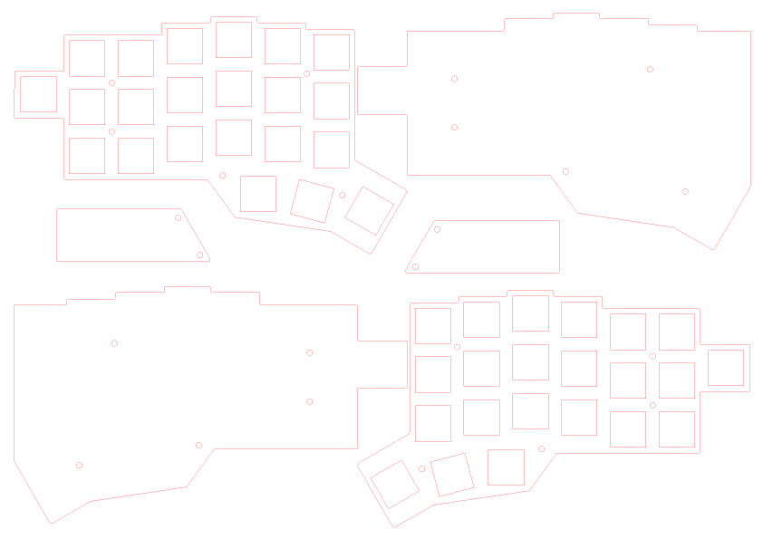
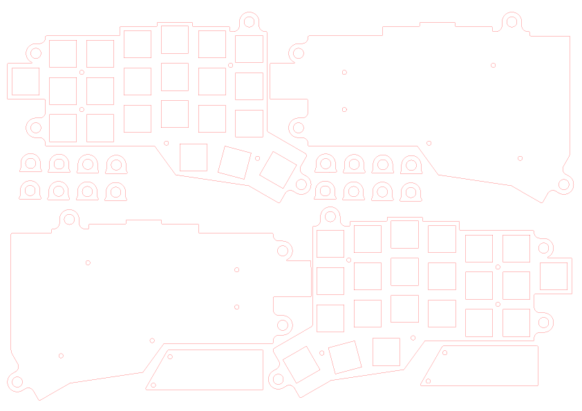
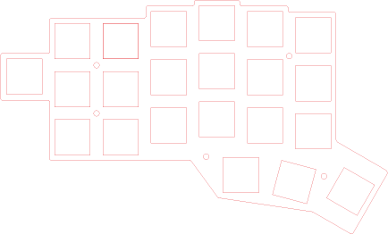

# Jorne

Corne with an extra key. Please refer to the official english [build guide](https://github.com/foostan/crkbd/blob/master/corne-classic/doc/buildguide_en.md) for assembly.

## Downloads

### Jorne Classic 2.1

* [jorne-classic-2.1-gerbers.zip](https://github.com/joric/crkbd/raw/jorne/gerbers/jorne-classic-2.1-gerbers.zip) (classic version, with mounting holes and ground planes)

### Jorne Cherry 2.1

* [jorne-cherry-2.1-gerbers.zip](https://github.com/joric/crkbd/raw/jorne/gerbers/jorne-cherry-2.1-gerbers.zip) (hotswap version with kailh hotswap sockets)

## Case

Originally uses 3 mm acrylic glass for all the parts.

If you're preferring 1.6mm carbon mind that at least the screen protector piece should be transparent.

### Simple case

* [top-bottom-jorne.ai](https://github.com/joric/crkbd/raw/jorne/corne-classic/acrylic_plate/top-bottom-jorne.ai)

* [top-bottom-jorne.dxf](https://github.com/joric/crkbd/raw/jorne/corne-classic/acrylic_plate/top-bottom-jorne.dxf)

### Tilting-tenting case

* [tilting-tenting-jorne.ai](https://github.com/joric/crkbd/raw/jorne/corne-classic/acrylic_plate/tilting-tenting-jorne.ai)

* [tilting-tenting-jorne.dxf](https://github.com/joric/crkbd/raw/jorne/corne-classic/acrylic_plate/tilting-tenting-jorne.dxf)

### Metal plate

This is plate precisely the same as from the top-bottom above, but with 14mm cutouts instead of 13.85.

* [top-bottom-jorne-plate.ai](https://github.com/joric/crkbd/raw/jorne/corne-classic/acrylic_plate/top-bottom-jorne-plate.ai)

* [top-bottom-jorne-plate.dxf](https://github.com/joric/crkbd/raw/jorne/corne-classic/acrylic_plate/top-bottom-jorne-plate.dxf)

### Cutting services

* https://make.ponoko.com quotes [tilting-tenting-jorne.ai](https://github.com/joric/crkbd/raw/jorne/corne-classic/acrylic_plate/tilting-tenting-jorne.ai)
(3mm clear acrylic) for $14.85 (with free shipping to USA, **shipping to other countries starts from $65**, unfortunately).
Mind that hotswap version needs 1.5mm plate or switches won't snap. I like the look of the gray translucent acrylic.

## Firmware

Compatible with [stock Corne firmware](https://github.com/qmk/qmk_firmware/tree/master/keyboards/crkbd). The extra key can be snapped off. [Bluetooth firmware version](https://github.com/joric/nrfmicro/wiki/Corne-BLE) is in progress.

## PCB manufacturers

I recommend [JLCPCB.com](https://jlcpcb.com). New users gets $8 discount, so 5 black matte PCBs cost $9.88 total, including shipping.

## Modification

In order to make your own Corne clone, you need to do the following:

* Fix "find segment with an endpoint" error messages on Alt+3 (see https://github.com/foostan/crkbd/pull/21)
* Fix the schematic to your taste (add an extra key to the free row, add an extra LED to the end of the strip)
* Press Ctrl+Q to update the PCB (uncheck the "Delete extra footprints" setting)
* Fix the 1.75u footprint for the autorouting (I moved bottom pads a little bit apart)
* Export "Specctra DSN" file, run Freerouting and autoroute the board, import Specctra session file
* Use "Create Corner" for the Zone Outlines, move corners to match the new outline (they autoupdate)
* Plot with "Use Protel filename extensions", generate drill files with "PTH and NPTH in a single file"

Note I did not reroute the whole board, just autorouted a few new traces and it worked.

## Pictures

More pictures: https://imgur.com/a/T2GXaLw

## Video

## Archive

### Jorne Classic 2.0

Version 2.0 has been already assembled and checked, everything works fine.

* [jorne-classic-2.0-gerbers.zip](https://github.com/joric/crkbd/raw/jorne/gerbers/jorne-classic-2.0-gerbers.zip)

* [jorne-classic-2.0.png](images/jorne-classic-2.0.png) (image)

**WARNING** no mounting holes and ground zones in this revision (lost in conversion)!

## Embedded nRFMicros

Added two nRFMicro boards to the gerbers, NO other changes.

To merge your boards, start pcbnew by itself without starting the entire KiCad application. Then open one of the .kicad_pcb files. Then, use the "File" - "Append Board" command to bring in another PCB layout, edit edge cuts and plot the gerbers.

#### WARNING

JLCPCB apparently treats those two as separate designs and asks for additional $24.
I had to remove miling slot between two different "designs" as stated here: https://support.jlcpcb.com/article/49-pcb-panelization.
Use something sharp to cut a groove and break the daughter board off.

**Upd** Apparently that was not enough, I'm still getting "suspended". DO NOT ORDER combined "designs" on JLCPCB, you will lose your coupons on cancelled orders.

#### Jorne Classic nRFMicro 2.1

* [jorne-cherry-nrfmicro-2.1-gerbers.zip](https://github.com/joric/crkbd/raw/jorne/gerbers/jorne-cherry-nrfmicro-2.1-gerbers.zip) (hotswap version with embedded nRFMicro, NOT accepted by JLCPCB)

* [jorne-cherry-nrfmicro-2.1.png](images/jorne-cherry-nrfmicro-2.1.png) (image)

## References

* https://github.com/foostan/crkbd
* https://github.com/joric/nrfmicro/wiki/Corne-BLE
