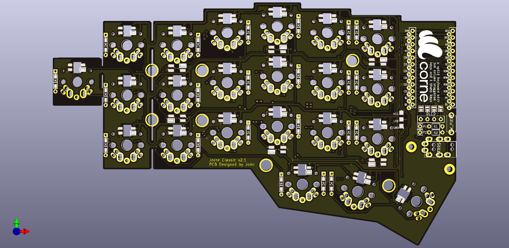
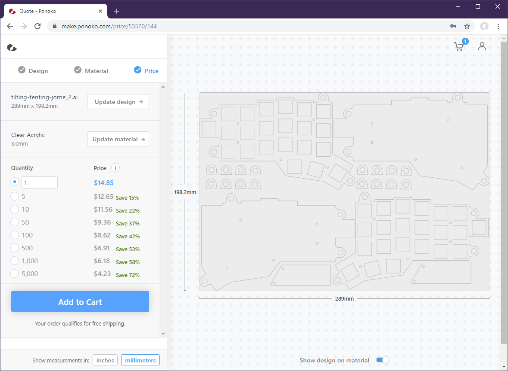

# Jorne

Corne with an extra key. Please refer to the official english [build guide](https://github.com/foostan/crkbd/blob/master/corne-classic/doc/buildguide_en.md) for assembly.

## Bill of Materials

Use combined trackable shipping whether it is possible, it is much faster and more reliable than economy shipping.

* [128x32 White OLED](https://www.aliexpress.com/item/32798439084.html) $1.57 (need 2), [black Pro Micros](https://www.aliexpress.com/item/32849563958.html) $3.20 (need 2), [1N4148 SMD diodes](https://www.aliexpress.com/item/32346066945.html) (need 44), same seller
* [SK6812 3535 BL](https://www.aliexpress.com/item/32623583544.html) LEDs, you will need 12 (6 per half for the ambient), or 56 for the full RGB ($6.56 for 50 pcs)
* [TRRS sockets, PJ320A (20 pcs)](https://www.aliexpress.com/item/32368285821.html), $1.32
* [TRRS cable (angled, 15 cm)](https://www.aliexpress.com/item/32887579795.html), $1.59
* [DIP 3*6*4.3mm tactile push button (30 pcs)](https://www.aliexpress.com/item/32901277211.html), $0.56
* [M2 screws](https://www.aliexpress.com/item/32950593680.html) (6mm, 28 pcs), [M2 standoffs](https://www.aliexpress.com/item/32597776358.html) (6mm, 14 pcs), same seller
* [(Optional) 3.5mm pin headers](https://www.aliexpress.com/item/32888288845.html) to hotswap OLED and Pro Micros
* [(Optional) 3mm bumpons](https://www.aliexpress.com/item/32912066603.html) (black), [another ones](https://www.aliexpress.com/item/32680543746.html) (clear)

## PCB Manufacturers

* [JLCPCB.com](https://jlcpcb.com). New users get $8 discount, so 5 black matte PCBs cost $9.88 total, including shipping.

## Laser cutting services

* [Elecrow](https://www.elecrow.com/5pcs-acrylic-laser-cutting-service.html) cuts acrylic glass for cheap. Ordered [5 full sets](https://i.imgur.com/T2h6KQt.jpg) (20x30cm) for $35 (including shipping),
	5 half-sets (15x20cm) cost maybe $20 (they only ship in multiple of 5).
	Got 3mm black translucent acrylic after emailing support@elecrow.com
* [GDCTECH Store](https://www.aliexpress.com/item/32966756953.html) on Aliexpress cuts 1.5mm carbon
	($67 including shipping for the 40x50cm sheet)
* [Laserboost](https://laserboost.com) wants about 40 EUR for steel and 60 EUR for aluminum for the 12x35cm sheet
	(plus 14 EUR shipping)

## Firmware

Still a little bit incomplete but extra keys work:

* https://github.com/joric/qmk_firmware/tree/joric-crkbd/keyboards/crkbd/keymaps/joric


## Downloads

### Jorne Classic 2.1

* [jorne-classic-2.1-gerbers.zip](https://github.com/joric/crkbd/raw/jorne/gerbers/jorne-classic-2.1-gerbers.zip) (classic version, with mounting holes and ground planes)



### Jorne Cherry 2.1

* [jorne-cherry-2.1-gerbers.zip](https://github.com/joric/crkbd/raw/jorne/gerbers/jorne-cherry-2.1-gerbers.zip) (hotswap version with kailh hotswap sockets)


## Case files

Cutouts are 13.85mm for switches to hold in acrylic class. You need to edit the file to make 14.00mm cutouts for steel.

* [jorne-simple.dxf](https://github.com/joric/crkbd/raw/jorne/dxf/jorne-simple.dxf) (simple case)
* [jorne-tilted.dxf](https://github.com/joric/crkbd/raw/jorne/dxf/jorne-tilted.dxf) (tilting-tenting case)

This is new half-size version (for one half) made in Inkscape. See archived case files below for full-size versions.

## Firmware

Compatible with [stock Corne firmware](https://github.com/qmk/qmk_firmware/tree/master/keyboards/crkbd). The extra key can be snapped off. [Bluetooth firmware version](https://github.com/joric/nrfmicro/wiki/Corne-BLE) is in progress.

## Modification

In order to make your own Corne clone, you need to do the following:

* Fix "find segment with an endpoint" error messages on Alt+3 (see https://github.com/foostan/crkbd/pull/21)
* Fix the schematic to your taste (add an extra key to the free row, add an extra LED to the end of the strip)
* Press Ctrl+Q to update the PCB (uncheck the "Delete extra footprints" setting)
* Fix the 1.75u footprint for the autorouting (I moved bottom pads a little bit apart)
* Export "Specctra DSN" file, run Freerouting and autoroute the board, import Specctra session file
* Use "Create Corner" for the Zone Outlines, move corners to match the new outline (they autoupdate)
* Plot with "Use Protel filename extensions", generate drill files with "PTH and NPTH in a single file"

Note I did not reroute the whole board, just autorouted a few new traces and it worked.

## Pictures


More pictures: https://imgur.com/a/T2GXaLw

## Video

[](https://youtu.be/JKPftgYVeUQ)

## Archive

### Jorne Classic 2.0

Version 2.0 has been already assembled and checked, everything works fine.

* [jorne-classic-2.0-gerbers.zip](https://github.com/joric/crkbd/raw/jorne/gerbers/jorne-classic-2.0-gerbers.zip)

* [jorne-classic-2.0.png](images/jorne-classic-2.0.png) (image)

**WARNING** no mounting holes and ground zones in this revision (lost in conversion)!

## Embedded nRFMicros

Added two nRFMicro boards to the gerbers, NO other changes.

To merge your boards, start pcbnew by itself without starting the entire KiCad application. Then open one of the .kicad_pcb files. Then, use the "File" - "Append Board" command to bring in another PCB layout, edit edge cuts and plot the gerbers.

#### WARNING

JLCPCB apparently treats those two as separate designs and asks for additional $24.

```
to: support@jlcpcb.com

I was trying to manufacture prototype boards using attached gerbers (also see the picture
https://i.imgur.com/qTdJm5N.jpg). The PCB got suspended (probably because I added my nRFMicro
board to the design) despite all those parts are complimentary. It's impossible to distinguish
those 2 (or 4?) separate designs automatically, so I assume human factor, the auditor
is just trying to earn some money for the company.

So far I've cancelled the order and refunded the money (order Y7-2675244A).
I'm not going to reorder two bords separately so your auditor just've lost a bunch of money
instead of saving them.

Could you please tell me how to place those boards properly to pass the audit?
I wouldn't really like to cut the boards with scissors or something,
because 1 milled slot doesn't really cost anything and that would be highly illogical
and weird for the users who would try to order those opensourced boards using JLCPCB.
```

```
from: support@jlcpcb.com

Dear client, thank you for your email.
After checking your file there are 2 different designs in your file.
Due to our company policy, if you have more than 1 design we will charge you extra fee.
And if you wanna pass the system and don't wanna to pay for the extra fee,
I suggest you remove the slot between the 2 boards.
```

I had to remove miling slot between two different "designs" as stated here: https://support.jlcpcb.com/article/49-pcb-panelization.
They suggest then to use something sharp to cut a groove and break the daughter board off.

**Upd:** Apparently that was not enough, I'm still getting "suspended". **DO NOT ORDER** combined "designs" on JLCPCB, you will lose your coupons on cancelled orders.


#### Jorne Classic nRFMicro 2.1

* [jorne-cherry-nrfmicro-2.1-gerbers.zip](https://github.com/joric/crkbd/raw/jorne/gerbers/jorne-cherry-nrfmicro-2.1-gerbers.zip) (hotswap version with embedded nRFMicro, NOT accepted by JLCPCB)

* [jorne-cherry-nrfmicro-2.1.png](images/jorne-cherry-nrfmicro-2.1.png) (image)

### Ponoko

* https://make.ponoko.com quotes [tilting-tenting-jorne.ai](https://github.com/joric/crkbd/raw/jorne/corne-classic/acrylic_plate/tilting-tenting-jorne.ai)
(3mm clear acrylic) for $14.85 (with free shipping to USA, **shipping to other countries starts from $65**, unfortunately).
Mind that hotswap version needs 1.5mm plate or switches won't snap. I like the look of the gray translucent acrylic.



## Archived case files

### Simple case

* [top-bottom-jorne.ai](https://github.com/joric/crkbd/raw/jorne/corne-classic/acrylic_plate/top-bottom-jorne.ai)
* [top-bottom-jorne.dxf](https://github.com/joric/crkbd/raw/jorne/corne-classic/acrylic_plate/top-bottom-jorne.dxf)
* [top-bottom-jorne.png](images/top-bottom-jorne.png)

### Tilting-tenting case

* [tilting-tenting-jorne.ai](https://github.com/joric/crkbd/raw/jorne/corne-classic/acrylic_plate/tilting-tenting-jorne.ai)
* [tilting-tenting-jorne.dxf](https://github.com/joric/crkbd/raw/jorne/corne-classic/acrylic_plate/tilting-tenting-jorne.dxf)
* [tilting-tenting-jorne.png](images/tilting-tenting-jorne.png)

### Metal plate

This is plate precisely the same as from the top-bottom above, but with 14mm cutouts instead of 13.85.

* [top-bottom-jorne-plate.ai](https://github.com/joric/crkbd/raw/jorne/corne-classic/acrylic_plate/top-bottom-jorne-plate.ai)
* [top-bottom-jorne-plate.dxf](https://github.com/joric/crkbd/raw/jorne/corne-classic/acrylic_plate/top-bottom-jorne-plate.dxf)
* [top-bottom-jorne-plate.png](images/top-bottom-jorne-plate.png)


## References

* https://github.com/foostan/crkbd
* https://github.com/joric/nrfmicro/wiki/Corne-BLE
